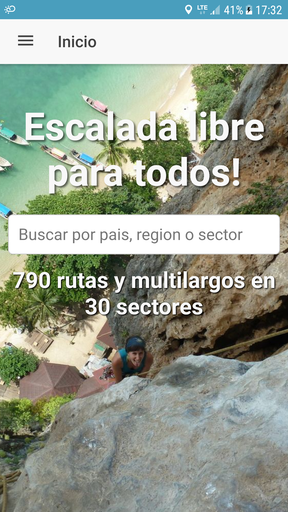

# Topos Ya Mobile app

Free rock climbing information

## Installation

This software is based on Ionic, please refer to ionic v3 documentation on how to run it on Android or Ios:

## Release History

* 0.0.1
    * Initial commits

## Meta

Breinlinger Juan Paulo – juan.brein@breins.net

Distributed under the GNU General Public License v3.0 license. See ``LICENSE`` for more information.

View official GNU site http://www.gnu.org/licenses/gpl.html.

## Contributing

1. Fork it (<https://github.com/ToposYa/mobile/fork>)
2. Create your feature branch (`git checkout -b feature/fooBar`)
3. Commit your changes (`git commit -am 'Add some fooBar'`)
4. Push to the branch (`git push origin feature/fooBar`)
5. Create a new Pull Request
